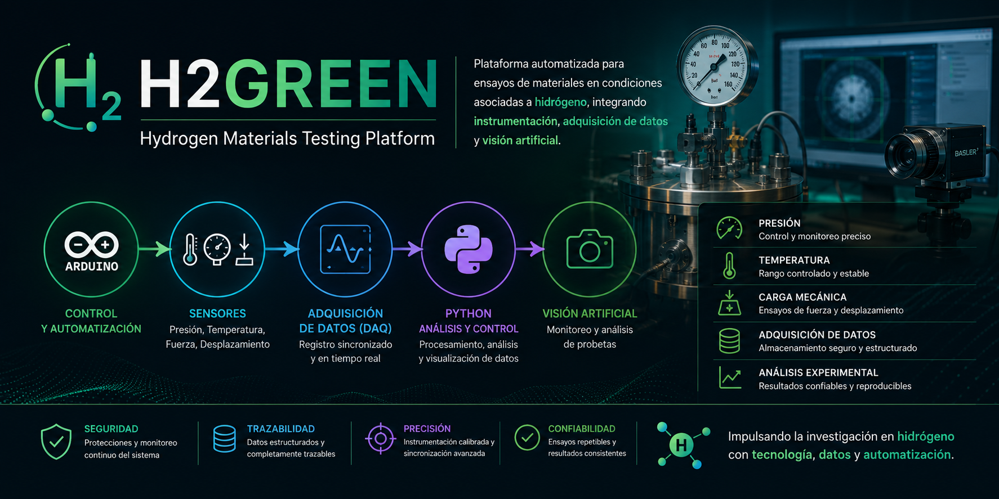

 

# H2GREEN - Plataforma Automatizada de Ensayo para Evaluación de Materiales en Condiciones Asociadas a Hidrógeno

## Descripción General

Este proyecto corresponde al desarrollo de una plataforma automatizada de ensayo orientada a la evaluación de materiales sometidos a condiciones controladas de presión, temperatura y carga mecánica, con aplicación en estudios relacionados con fragilización por hidrógeno y validación de materiales para sistemas de hidrógeno.

La plataforma está siendo desarrollada como apoyo a la iniciativa **H2GREEN**, permitiendo la generación de datos experimentales mediante una arquitectura distribuida basada en Python y Arduino, incorporando instrumentación industrial y visión artificial para la automatización completa del proceso de ensayo.

---

# Índice

- Descripción General
- Objetivos del Sistema
- Arquitectura General
- Documentación Técnica
- Instrumentación Principal
- Secuencia Operacional
- Seguridad
- Estado Actual del Proyecto
- Hardware Pendiente de Integración
- Tecnologías Utilizadas

---

# Objetivos del Sistema

- Automatizar la secuencia completa de ensayo.
- Controlar presión, temperatura y velocidad de ensayo.
- Medir fuerza y desplazamiento de probetas.
- Registrar datos experimentales en tiempo real.
- Generar curvas esfuerzo-deformación.
- Integrar visión artificial mediante cámara Basler.
- Incorporar funciones de seguridad y monitoreo continuo.

---

# Arquitectura General

La siguiente figura resume la arquitectura general actualmente implementada para el proyecto H2GREEN.

---

# Documentación Técnica

La documentación técnica completa del proyecto se encuentra organizada en la carpeta **docs/Diagramas**, donde se describe detalladamente cada uno de los módulos desarrollados.

## Incluye

- Arquitectura General del Sistema
- Lazo de Control de Presión
- Lazo de Control de Temperatura
- Lazo de Control de Desplazamiento
- Lazo de Fuerza y Desplazamiento
- Secuencia Completa del Proceso

### Acceso directo

➡ **[Ver documentación técnica completa](docs/Diagramas/README.md)**

---

# Nivel de Supervisión

## Dashboard Python

Funciones principales

- Supervisión del proceso.
- Registro automático en CSV.
- Visualización en tiempo real.
- Gestión de estados.
- Control de secuencia automática.
- Alarmas y eventos.
- Integración futura con cámara Basler.

---

# Nivel de Control

## Arduino Mega 2560 (Maestro)

Responsabilidades

- Coordinación de los Arduino esclavos.
- Comunicación serial con Python.
- Sincronización de eventos.
- Consolidación de datos.
- Distribución de comandos.

---

# Nivel de Adquisición y Control Distribuido

## Arduino Uno – Esclavo Presión

- Lectura de PT-01.
- Lectura de PT-02.
- Control de HVL1.
- Control de HVL2.
- Purga automática.
- Presurización automática.

---

## Arduino Uno – Esclavo Fuerza

- Lectura de celda de carga de 20 kN.
- Acondicionamiento mediante HX711.
- Envío de datos al maestro.

---

## Arduino Uno – Esclavo Temperatura

- Lectura de temperatura.
- Control futuro mediante PID.
- Activación del SSR.
- Regulación térmica de la cámara.

---

## Arduino Uno – Esclavo Velocidad

- Control del driver SH-1108.
- Control del motor paso a paso.
- Gestión de velocidad.
- Seguimiento de posición.

---

# Instrumentación Principal

## Presión

- PT-01: Presión de cámara.
- PT-02: Presión de suministro.
- Transmisores industriales 4–20 mA.

## Fuerza

- Celda de carga 20 kN.
- Módulo HX711.

## Temperatura

- Sensor DS18B20.
- Relé de estado sólido (SSR).
- Calefactor de cartucho.

## Desplazamiento

- Cámara Basler.
- Software Pylon.
- Procesamiento mediante Python.

---

# Secuencia Operacional

La plataforma implementa la siguiente secuencia general de operación.

---

# Seguridad

El sistema incorpora diversas funciones orientadas a garantizar un funcionamiento seguro durante el ensayo.

- Función ABORTAR.
- Detención segura del motor.
- Apertura automática de purga.
- Cierre automático de presión.
- Bloqueo del ensayo antes de la exposición.
- Gestión de estados seguros.

---

# Estado Actual del Proyecto

## Implementado

- Dashboard Python.
- Comunicación serial.
- Arduino Mega Maestro.
- Arduino esclavo de presión.
- Arduino esclavo de fuerza.
- Arduino esclavo de temperatura.
- Arduino esclavo de velocidad.
- Registro automático CSV.
- Gráficos en tiempo real.
- Secuencia automática.
- Temporizador de exposición.
- Función ABORTAR.
- Control de versiones mediante Git y GitHub.

---

## En Desarrollo

- Detección automática de rotura.
- Control PID de temperatura.
- Integración de cámara Basler.
- Generación automática de reportes.
- Integración del hardware industrial definitivo.

---

# Hardware Pendiente de Integración

- Transmisores IFM 4–20 mA.
- Electroválvulas HVL1 y HVL2.
- SSR industrial.
- Calefactor de cámara.
- Cámara Basler.
- Accesorios de presión y seguridad.

---

# Tecnologías Utilizadas

## Software

- Python 3.12
- PyQt5
- PyQtGraph
- Visual Studio Code
- Git
- GitHub

## Hardware

- Arduino Mega 2560
- Arduino Uno
- HX711
- DS18B20
- Driver SH-1108
- Motor Stepper 86HS156-6204A14-B35-04

---

# Estado del Repositorio

**Versión oficial:** H2GREEN v1.0

Este repositorio constituye el entorno principal de desarrollo del proyecto H2GREEN. Aquí se integran el software de supervisión, el control distribuido mediante Arduino, la documentación técnica, los diagramas del sistema y el control de versiones, proporcionando una plataforma única para el desarrollo y seguimiento del proyecto.

---

**Proyecto H2GREEN**  
**Universidad Técnica Federico Santa María**  
Departamento de Ingeniería Mecánica – Departamento de Electrónica