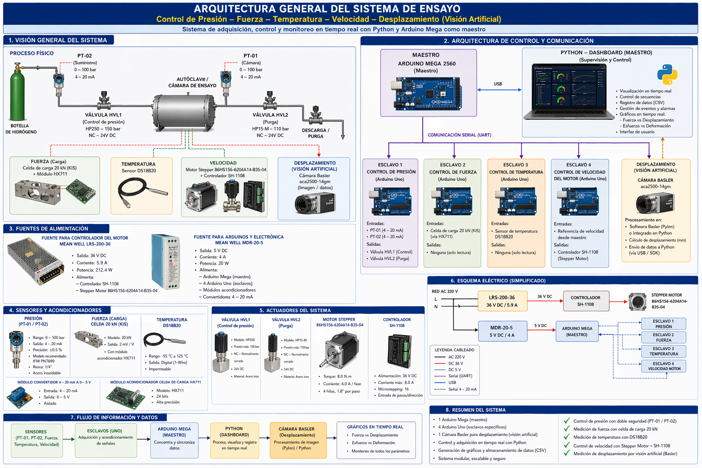
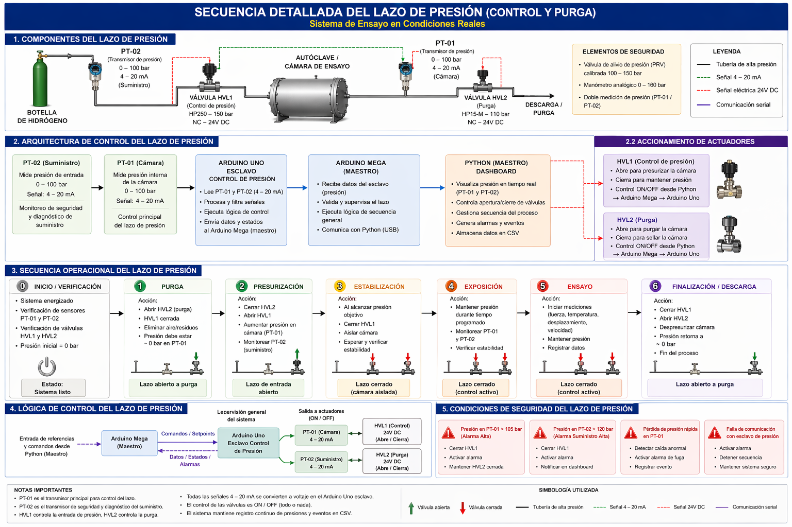
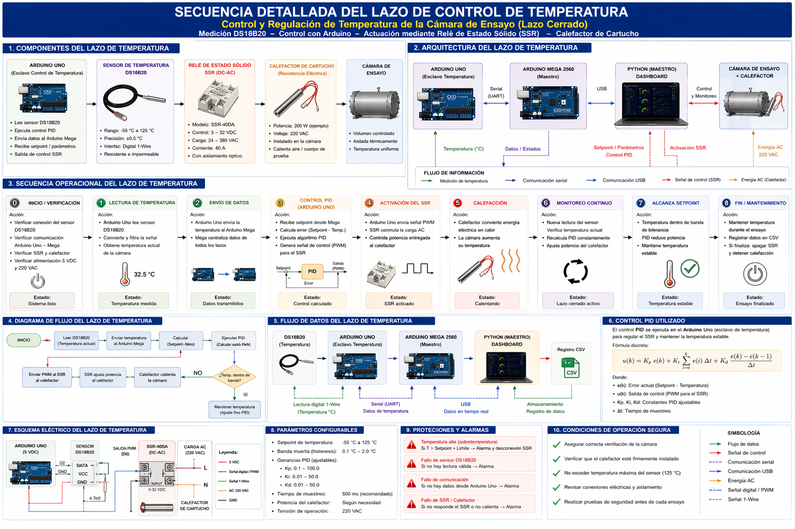
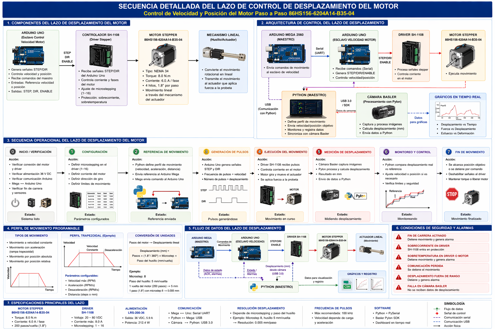
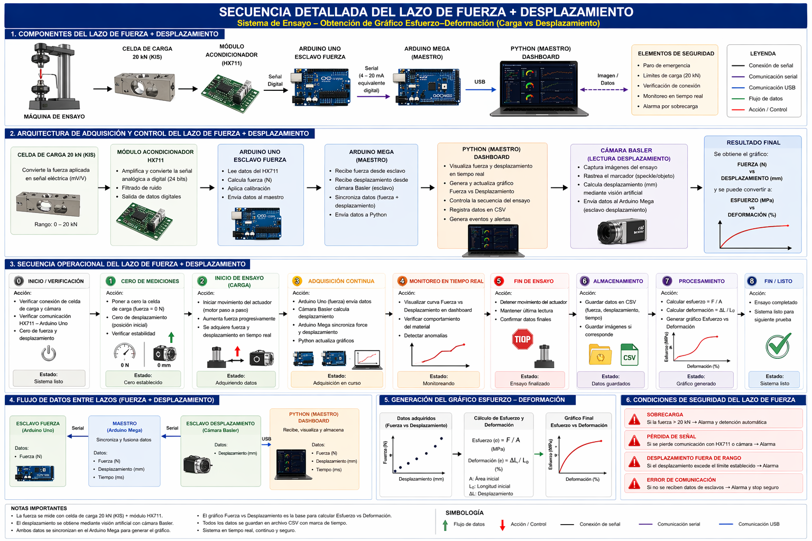
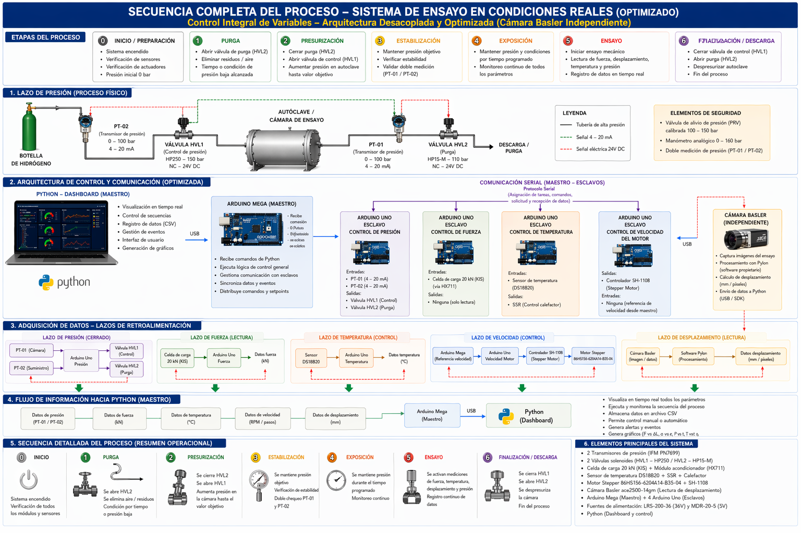

# H2GREEN - Diagramas del Proyecto

Esta carpeta reúne la documentación gráfica oficial del proyecto **H2GREEN**, desarrollada para describir la arquitectura general del sistema, los lazos de control implementados y la secuencia operacional del prototipo de ensayo automatizado para evaluación de materiales en atmósferas asociadas al hidrógeno.

---

# Índice

1. Arquitectura General del Sistema
2. Lazo de Control de Presión
3. Lazo de Control de Temperatura
4. Lazo de Control de Desplazamiento
5. Lazo de Fuerza y Desplazamiento
6. Secuencia Completa del Proceso

---

# 01. Arquitectura General del Sistema

## Objetivo

Presentar la arquitectura general del sistema, mostrando la interacción entre el Dashboard H2GREEN, Arduino Mega Maestro, Arduino esclavos, cámara Basler y dispositivos de campo.

## Implementación relacionada

- [Dashboard H2GREEN](../../python/Dashboards/Dashboard_H2Green_v1.0.py)
- [Arduino Mega Maestro](../../arduino/maestro/Mega_H2Green_v1.0.ino)
- [Arduino Presión](../../arduino/presion/Presion_H2Green_v1.0.ino)
- [Arduino Fuerza](../../arduino/fuerza/Fuerza_H2Green_v1.0.ino)
- [Arduino Temperatura](../../arduino/temperatura/Temperatura_H2Green_v1.0.ino)
- [Arduino Velocidad](../../arduino/velocidad/Velocidad_H2Green_v1.0.ino)

---

# 02. Secuencia Detallada del Lazo de Presión

## Objetivo

Documentar el funcionamiento del lazo de presión, incluyendo purga, presurización, estabilización y control de electroválvulas.

## Implementación relacionada

- [Dashboard H2GREEN](../../python/Dashboards/Dashboard_H2Green_v1.0.py)
- [Arduino Presión](../../arduino/presion/Presion_H2Green_v1.0.ino)

---

# 03. Secuencia Detallada del Lazo de Temperatura

## Objetivo

Describir el sistema de control térmico compuesto por sensor de temperatura, Arduino esclavo, SSR y calefactor.

## Implementación relacionada

- [Dashboard H2GREEN](../../python/Dashboards/Dashboard_H2Green_v1.0.py)
- [Arduino Temperatura](../../arduino/temperatura/Temperatura_H2Green_v1.0.ino)

---

# 04. Secuencia Detallada del Lazo de Desplazamiento del Motor

## Objetivo

Describir el control del desplazamiento mediante Arduino, driver SH-1108 y motor paso a paso.

## Implementación relacionada

- [Dashboard H2GREEN](../../python/Dashboards/Dashboard_H2Green_v1.0.py)
- [Arduino Velocidad](../../arduino/velocidad/Velocidad_H2Green_v1.0.ino)

---

# 05. Secuencia Detallada del Lazo de Fuerza y Desplazamiento

## Objetivo

Describir la adquisición de fuerza mediante la celda de carga y HX711, junto con el desplazamiento obtenido mediante visión artificial usando la cámara Basler.

## Implementación relacionada

- [Dashboard H2GREEN](../../python/Dashboards/Dashboard_H2Green_v1.0.py)
- [Arduino Fuerza](../../arduino/fuerza/Fuerza_H2Green_v1.0.ino)

---

# 06. Secuencia Completa del Proceso

## Objetivo

Integrar todos los lazos de control y mostrar la secuencia completa de operación del sistema H2GREEN desde la inicialización hasta la finalización del ensayo.

## Implementación relacionada

- [Dashboard H2GREEN](../../python/Dashboards/Dashboard_H2Green_v1.0.py)
- [Arduino Mega Maestro](../../arduino/maestro/Mega_H2Green_v1.0.ino)

---

# Estado del Proyecto

**Versión:** Prototipo 001

### Estado actual

- ✅ Arquitectura general validada.
- ✅ Dashboard Python operativo.
- ✅ Arduino Mega Maestro operativo.
- ✅ Arduino esclavo de presión operativo.
- ✅ Arduino esclavo de fuerza operativo.
- ✅ Arduino esclavo de temperatura operativo.
- ✅ Arduino esclavo de velocidad operativo.
- 🔄 Integración de la cámara Basler en desarrollo.
- 🔄 Integración del hardware definitivo (transmisores, electroválvulas y sistema térmico).

---

**Proyecto H2GREEN**  
Universidad Técnica Federico Santa María  
Departamento de Ingeniería Mecánica – Departamento de Electrónica